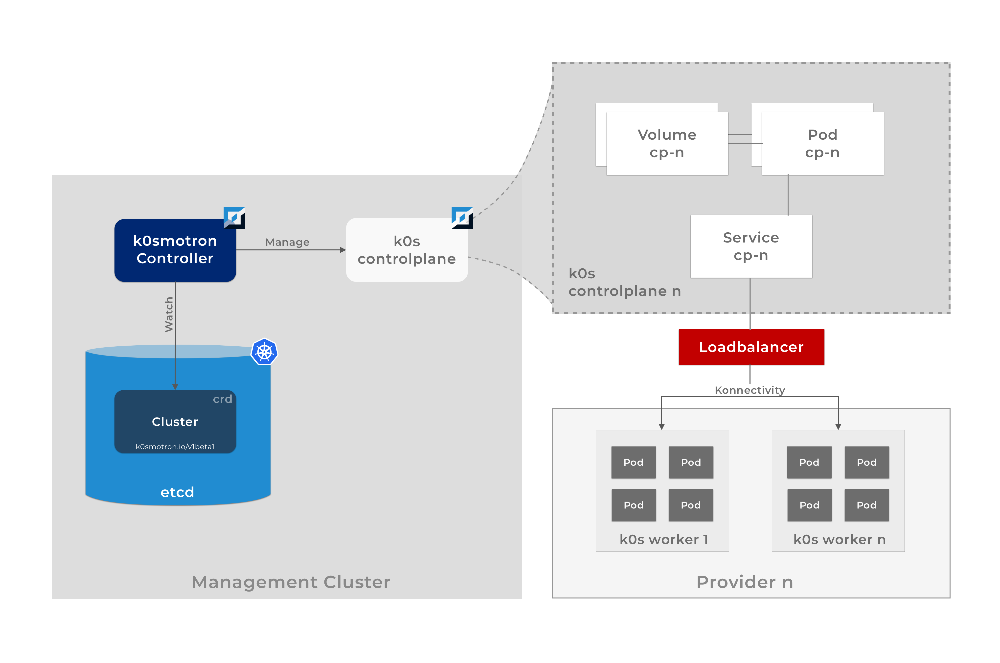

# k0smotron - The Kubernetes control plane manager

From pets to cattle: Streamline your Kubernetes control plane management with k0smotron

Powered by [k0s](https://docs.k0sproject.io)

## Features

### Kubernetes-in-Kubernetes

k0smotron allows you to easily create and manage the clusters in an existing Kubernetes cluster. This allows unparalled scalability and flexibility when you have to work with many clusters. It allows truly homogenous setup for all control planes and thus eases the maintenance burden.

### True control and worker plane separation

Using k0smotron the clusters controlplane and workerplane are truly separated. The controlplane, running on an existing cluster has no direct networking connection to the workerplane. This is similar patter nhow all the major cloud providers separate the control and worker planes on the managed clusters. 

### Bring your own workers

With k0smotron you can connect worker nodes from ANY infrastructure to your cluster control plane. 

## How does it work

You install k0smotron operator into an existing Kubernetes cluster. k0smotron operator will create and manage [k0s](https://docs.k0sproject.io) control planes in that cluster. It leverages the natural pattern of working with custom resources to manage the lifecycle of the k0s control planes. k0smotron will automatically create all the needed Kubernetes lower level constructs, such as pods, configmaps etc., to run and manage the control planes.

k0smotron is an Kubernetes operator designed to manage the lifecycle of k0s control planes in a Kubernetes (any distro) cluster. By running the control plane on a k8s cluster we can enjoy and leverage the high availability and auto-healing functionalities of the underlying cluster, a.k.a Mothership.

## Use cases

### CI/CD

Often when running integration and end-to-end testing for your software running in Kubernetes you need somewhat temporary clusters in CI. Why not leverage the true flexibility and create those clusters on-demand using k0smotron. Creating a controlplane is as easy as creating a custom resource, so is the deletion of it. No more long living snowflake clusters for CI purposes.

### Edge

Running Kubernetes on the network edge usually means running in low resource infrastructure. What this often means is that setting up the controlplane is either a challenge or a mission impossible. Running the controlplane on a existing cluster, on a separate dedicated infrastructure, removes that challenge and let's you focus on the real edge. 

Running on the edge often also means large number of clusters to manage. Do you really want to dedicate nodes for each cluster controlplane and manage all the infrastructure for those?

### Multi-cloud

With k0smotron you can run your control plane management cluster (a.k.a Mothership) in one cloud provider and the workloads in various other cloud providers. This allows you to build and maintain a very streamlined approach to multi cloud.